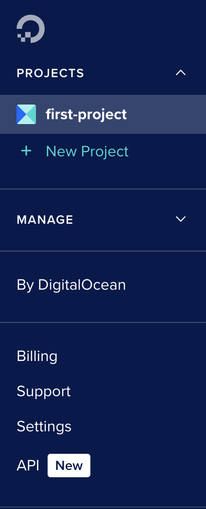
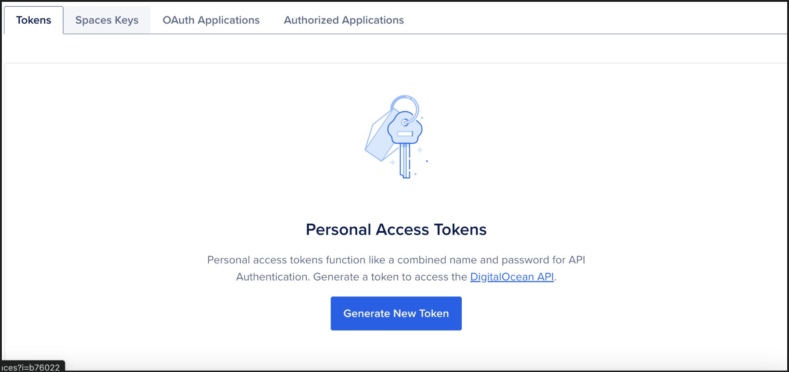
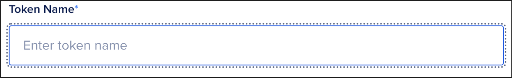
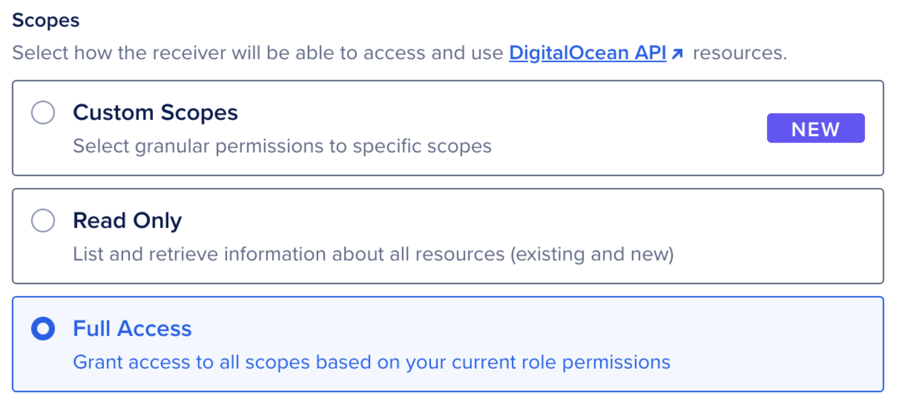
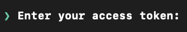
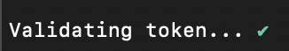

# How to Set Up a Arch Linux Droplet Using Doctl

### Table of Contents

1. Introduction
2. Task 1: Creating SSH key
3. Task 2: Installing Doctl
4. Task 3: Task 3: Creating a cloud-init file
5. Task 4: Making the droplet with the cloud-init file

### Introduction

This tutorial will guide you through the steps that allows you to make your own Arch Linux Droplet using doctl. 

What is Arch Linux?
Arch Linux is an open source Linux distribution which is a minimal base system, that can be configured by the users for what they want (1).

What is a SSH key? 
A key so that you can securely connect between your device and something else, in this case we are going to connect to a VM. You have a private and public key for this.

What is a Droplet?
Droplets from DigitalOcean are Linux-based Virtual Machines(VMs) that run on virtualized hardware (2).

What is Doctl?
Doctl is the DigitalOcean command line interface (CLI) (3).

What is Cloud-init?
Cloud-init is a tool that handles a range of tasks from setting hostname, configuring network interfaces, etc when a new instance is created. Mainly we will be using it to run a script. (5)

By the end of this tutorial, you will be able to learn how to:
- Create your own SSH keys on your local machine.
- Install doctl on your Arch Linux machine.
- Connect your Digital Ocean account to your Arch Linux machine using doctl. 
- Use cloud-init to download all necessary packages.
- Create a new droplet using doctl.

### Task 1: Creating SSH key

**Overview:** This task will help you create your own SSH key pair (a private and public key) which will be used to connect to your digital ocean droplet.

1. **Make a SSH key**
Use the following command,
```
ssh-keygen -t ed25519 -f ~/.ssh/doctl-key -C "USERNAME"
```

In this case the USERNAME can be your username or your email. 
-  `ssh-keygen`: OpenSSH authentication key utility that is built in into your OS machine. (7)
-  `-t`: Specifies the type of key to create. In this case it would be the default "ed25519". (7)
-  `-f`: *filename* Specifies the filename of the key file. (7)
-  `~`: The home directory. (7)
- `-C`: Provides a new comment. (7)

It will prompt you for a password, however just press `Enter` twice to have no password for your SSH key.

2. **Check if SSH key is in our system**
Now we should check if we have our SSH key in our ssh directory, type this command in your terminal
```
ls ~/.ssh
```
to check if files `doctl-key`, which is your private key (do not share this) and `doctl-key.pub`, which is your public key to use to make the droplet, are listed.

- `cd`: This is used to change directory. (7)
- `ls`: This is used to list all the files and directories in the current directory that you are in. (7)

Congratulations, you have now created your own SSH keys.

### Task 2: Installing Doctl and Connecting DigitalOcean using an API.

**Overview**: This task will help guide you to install doctl on your terminal and creating your first droplet using doctl.

1. **Install Doctl**
First run 
```
sudo pacman -S doctl
```
- sudo: Raises your privileges to run certain commands
- pacman: Package manager from arch

2. **Create an API token**
Now we will create an API token and make it so it grants account access to doctl. Go to your DigitalOcean account, then on the left hand dashboard, click on **API**


Click **Generate New Token**



Enter your token name



Select **Full Access**, this will grant you the token all scopes available


Click **Generate Token**

3. **Now use the API token to grant access to Doctl**
Copy your personal access token from the DigitalOcean site, then go to your arch terminal and running the command
```
doctl auth init --context <NAME>
```
`<NAME>` is name you give you give to save the token.
- `doctl auth init`: Initializes doctl to use a specific account (3).
- `--context`: Specify a custom authentication context name (3).

Now there will be a prompt,



Paste your personal access token from the DigitalOcean site. You should get a confirmation: 



Now we will switch to your account by running 
```
doctl auth switch --context <NAME>
```
Where `<NAME>` is the input that you used when you initialized your authorization. 
- `switch`: Allows you to switch between authentication contexts you have already created (3).

Finally check if your account is connected by running
```
doctl account get
```
Where you can get the following details of your account profile (3):
- Email address
- Team
- Account Droplet limit
- Email verification status
- UUID for the account
- Account status (active or disabled).

Confirm the details and now you have connected your account to your arch.

4. Connect your SSH key to DigitalOcean

First use the command,
```
cat ~/.ssh/doctl-key.pub
```
your public SSH key should show up. Now copy the key.
- `cat`: Show contents of a file all at once (3).

Then type the command (**Note: Do not copy this code as your clipboard will forget your SSH key that copied in the previous step**)
```
doctl compute ssh-key "<KEYNAME>" create --public-key "<Paste your key in here>"
```
where you name your key and paste your public SSH key in the following brackets.
- `doctl compute ssh-key create`: Adds a new SSH key to your account (3).
- `--public-key`: Key contents (3).

### Task 3: Creating a Cloud-init file
This task will help you create and configure the Cloud-init file.

Before you start, we need to download a package called `neovim` which allows us to edit text files (5). Run the command,
```
sudo pacman -S neovim
```

1. Run the command,
```
mkdir droplet
```
- `mkdir`: Make directory. (7)
We want to make a directory as we don't want to clutter our home directory.

2. Now run the command,
```
cd droplet
```

3. Now run the command,
```
touch cloud-init
```
- `touch`: Makes a file. (7)

4. Then run,
```
nvim cloud-init
```
To open the cloud-init file and edit it using *nvim*.

5. Now press `i` on your keyboard and paste ALL of the code below in the file,
```
#cloud-config
users:
  - name: <Your name>
    primary_group: <Your group, keep this the same as your name>
    groups: wheel
    shell: /bin/bash
    sudo: ['ALL=(ALL) NOPASSWD:ALL']
    ssh-authorized-keys:
      - ssh-ed25519 ...
packages:
  - ripgrep
  - rsync
  - neovim
  - fd
  - less
  - man-db
  - bash-completion
  - tmux
disable_root: true
```
Press `esc` and type `:wq` to exit save the contents and exit nvim. 
- `users`: Adds users to the system. (12)
- `packages`: All packages that you will install.
	- `ripgrep`: A search tool. (3)
	- `rsync`: Provides fast incremental file transfer. (3)
	- `fd`: Easier way to use find. (3)
	- `less`: Viewing text files. (3)
	- `man-db`: Utility to read `man` pages. (3)
	- `bash-completion`: Programmable completion for bash shell. (3)
	- `tmux`: Terminal multiplier. (3)
- `disable_root`: This determines if root login is disabled or not. (5)

6. Once again you need to get your SSH key using `cat ~/.ssh/doctl-key.pub`. Now copy the key and once again run `nvim cloud-init` and paste your key inside the `ssh-authorized-keys` like, 
```
ssh-authorized-keys:
      - ssh-ed25519 AAAAAAAAAAAAAAAAAAAAAAAAAAAAAAAAAAAAAAAAAAAAAAAAAAAAAA name
```
Exit out of nvim again 

Now you have completed in making your Cloud-init YAML file inside the droplet directory.
