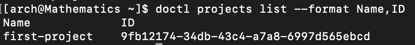
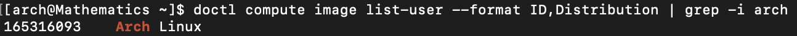
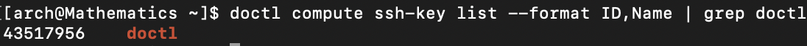

# How to Set Up a Arch Linux Droplet Using Doctl

## Table of Contents 
  - [Task 1: Creating SSH key](#task-1-creating-ssh-key)
  - [Task 2: Installing Doctl and Connecting DigitalOcean using an API.](#task-2-installing-doctl-and-connecting-digitalocean-using-an-api)
  - [Task 3: Creating a Cloud-init file](#task-3-creating-a-cloud-init-file)
  - [Task 4: Making the droplet with the cloud-init file](#task-4-making-the-droplet-with-the-cloud-init-file)
  - [Task 5: Connecting the droplet using the VM](#task-5-connecting-the-droplet-using-the-vm)
  - [Sources](#sources)

## Introduction

This tutorial will guide you through the steps that allows you to make your own Arch Linux Droplet using doctl. 

### What is Arch Linux?

Arch Linux is an open source Linux distribution which is a minimal base system, that can be configured by the users for what they want[^1].

### What is a SSH key? 

A key so that you can securely connect between your device and something else, in this case we are going to connect to a VM. You have a private and public key for this.

### What is a Droplet?

Droplets from DigitalOcean are Linux-based Virtual Machines(VMs) that run on virtualized hardware[^2].

### What is Doctl?

Doctl is the DigitalOcean command line interface (CLI)[^3].

### What is Cloud-init?

Cloud-init is a tool that handles a range of tasks from setting hostname, configuring network interfaces, etc when a new instance is created. Mainly we will be using it to run a script[^5].

By the end of this tutorial, you will be able to learn how to:
- Create your own SSH keys on your local machine.
- Install doctl on your Arch Linux machine.
- Connect your DigitalOcean account to your Arch Linux machine using doctl. 
- Use cloud-init to download all necessary packages.
- Create a new droplet using doctl.

## Task 1: Creating SSH key

This task will help you create your own SSH key pair (a private and public key) which will be used to connect to your DigitalOcean droplet.

1. **Make a SSH key**

Use the following command,
```
ssh-keygen -t ed25519 -f ~/.ssh/doctl-key -C "USERNAME"
```

In this case the USERNAME can be your username or your email. 
-  `ssh-keygen`: OpenSSH authentication key utility that is built in into your OS machine[^7].
-  `-t`: Specifies the type of key to create. In this case it would be the default `ed25519`[^7].
-  `-f`: *filename* Specifies the filename of the key file[^7].
-  `~`: The home directory[^7].
- `-C`: Provides a new comment[^7].

It will prompt you for a password, however just press `Enter` twice to have no password for your SSH key.

2. **Check if SSH key is in our system**

Now we should check if we have our SSH key in our ssh directory, type this command in your terminal
```
ls ~/.ssh
```
to check if files `doctl-key`, which is your private key (do not share this) and `doctl-key.pub`, which is your public key to use to make the droplet, are listed.

- `cd`: This is used to change directory[^7].
- `ls`: This is used to list all the files and directories in the current directory that you are in[^7].

Congratulations, you have now created your own SSH keys[^4].

## Task 2: Installing Doctl and Connecting DigitalOcean using an API.

**Overview**: This task will help guide you to install doctl on your terminal and creating your first droplet using doctl.

1. **Install Doctl**

First run 
```
sudo pacman -S doctl
```
- sudo: Raises your privileges to run certain commands
- pacman: Package manager from arch

2. **Create an API token**

Now we will create an API token and make it so it grants account access to doctl. Go to your DigitalOcean account, then on the left hand dashboard, click on **API**[^8].


Click **Generate New Token**


Enter your token name


Select **Full Access**, this will grant you the token all scopes available.


Click **Generate Token**

3. **Use the API token to grant access to Doctl**

Copy your personal access token from the DigitalOcean site, then go to your arch terminal and running the command.
```
doctl auth init --context <NAME>
```
`<NAME>` is name you give you give to save the token.
- `doctl auth init`: Initializes doctl to use a specific account[^3].
- `--context`: Specify a custom authentication context name[^3].

Now there will be a prompt,


Paste your personal access token from the DigitalOcean site. You should get a confirmation: 


Now we will switch to your account by running 
```
doctl auth switch --context <NAME>
```
Where `<NAME>` is the input that you used when you initialized your authorization. 
- `switch`: Allows you to switch between authentication contexts you have already created[^3].

Finally check if your account is connected by running
```
doctl account get
```
Where you can get the following details of your account profile (3):
- Email address
- Team
- Account Droplet limit
- Email verification status
- UUID for the account
- Account status (active or disabled).

Confirm the details and now you have connected your account to your arch.

4. **Connect your SSH key to DigitalOcean**

First use the command,
```
cat ~/.ssh/doctl-key.pub
```
your public SSH key should show up. Now copy the key.
- `cat`: Show contents of a file all at once[^3].

Then type the command 
>[!Note]
>Do not copy this code as your clipboard will forget your SSH key that copied in the previous step
```
doctl compute ssh-key "<KEYNAME>" create --public-key "<Paste your key in here>"
```
where you name your key and paste your public SSH key in the following brackets.
- `doctl compute ssh-key create`: Adds a new SSH key to your account[^3].
- `--public-key`: Key contents[^3].

Congratulations, you have now finished installing Doctl[^6].

## Task 3: Creating a Cloud-init file
This task will help you create and configure the Cloud-init file.

Before you start, we need to download a package called `neovim` which allows us to edit text files[^5]. Run the command,
```
sudo pacman -S neovim
```

1. **Make a directory**

Run the command,
```
mkdir droplet
```
- `mkdir`: Make directory[^7].
We want to make a directory as we don't want to clutter our home directory.

2. **Change to the droplet directory** 

Run the command,
```
cd droplet
```

3. **Create a file**

Run the command,
```
touch cloud-init
```
- `touch`: Makes a file[^7].

4. **Open the file using nvim**

Run,
```
nvim cloud-init
```
To open the cloud-init file and edit it using *nvim*.

5. **Configure your Cloud-init**

Now press `i` on your keyboard and paste ALL of the code below in the file,
```
#cloud-config
users:
  - name: <Your name>
    primary_group: <Your group, keep this the same as your name>
    groups: wheel
    shell: /bin/bash
    sudo: ['ALL=(ALL) NOPASSWD:ALL']
    ssh-authorized-keys:
      - ssh-ed25519 ...
packages:
  - ripgrep
  - rsync
  - neovim
  - fd
  - less
  - man-db
  - bash-completion
  - tmux
disable_root: true
```
Press `esc` and type `:wq` to exit save the contents and exit nvim. 
- `users`: Adds users to the system[^12].
- `packages`: All packages that you will install.
	- `ripgrep`: A search tool[^3].
	- `rsync`: Provides fast incremental file transfer[^3].
	- `fd`: Easier way to use find[^3].
	- `less`: Viewing text files[^3].
	- `man-db`: Utility to read `man` pages[^3].
	- `bash-completion`: Programmable completion for bash shell[^3].
	- `tmux`: Terminal multiplier[^3].
- `disable_root`: This determines if root login is disabled or not[^5].

6. **Paste your SSH key inside Cloud-init**

Once again you need to get your SSH key using `cat ~/.ssh/doctl-key.pub`. Now copy the key and once again run `nvim cloud-init` and paste your key inside the `ssh-authorized-keys` like, 
```
ssh-authorized-keys:
      - ssh-ed25519 AAAAAAAAAAAAAAAAAAAAAAAAAAAAAAAAAAAAAAAAAAAAAAAAAAAAAA name
```
Exit out of nvim again 

Now you have completed in making your Cloud-init YAML file inside the droplet directory.

## Task 4: Making the droplet with the cloud-init file
Now that you are done making a cloud-init file, you will now proceed to make a droplet using doctl. First you will need to find all the data necessary on your account to make the droplet.

>[!Note]
>Make sure **NOT** to run *clear* when running these following commands as you will need to have the ID's for your *project, arch image,* and *ssh-key* to copy and paste.

1. **Checking projects in DigitalOcean**

Check if you have multiple projects on your DigitalOcean account by running,
```
doctl projects list --format Name,OwnerUUID
```
This command will show all your project names with each respective UUID,
- `doctl projects list`: List details for your DigitalOcean projects[^3].
- `--format`: Flag to return only the `Name` and `OwnerUUID` in this case[^3].



Now decide which project you want to use, for the droplet that you are going to make.

2. **Finding Arch Linux image ID**

If you have made multiple custom images on your DigitalOcean account, run this command to find your Arch Linux image.
```
doctl compute image list-user --format ID,Distribution | grep -i arch
```
- `doctl compute image list-user`: Lists all user-created images that you have uploaded to your account[^3].
- `|` : Pipe operator, which takes the output from one command and uses it as an input for another[^9].
- `grep`: Searches file(s) {In this case this searches the list of all images} for specific text[^7].
- `-i `: Ignores case sensitivity[^7].

Make sure you have your ID and the name "Arch Linux" as the output.



3. **Find ID of doctl-key**

Run this command to find the ID of the `doctl` key you made and connected with your DigitalOcean account.
```
doctl compute ssh-key list --format ID,Name | grep doctl
```
- `doctl compute ssh-key list`: lists information on all SSH keys on your DigitalOcean account[^3].

>[!Note]
> If you made it under a different name, change the `doctl` part of the command after > *grep* to whatever name you made it as.

Make sure you have the ID and the name of your SSH key that you made earlier.



4. **Making the Droplet**

Run this command to make your droplet,
```
doctl compute droplet create <droplet name> --size s-1vcpu-1gb-amd --region Sfo3 --user-data-file ~/droplet/cloud-init --project-id <Paste your Project UUID> --image <Paste your Arch Linux image ID> --ssh-keys <Paste your SSH key ID>
```
- `doctl compute droplet create`: Creates a new Droplet on your account[^3].
- `--size`: A slug indicating the Droplet's number of vCPUs, RAM and disk size[^3].
	- In this case we are using `s-1vcpu-1gb-amd` which is a Basic AMD with 1 GB CPU memory, 1 vCPU, and 10GB of Disk space.
	- If you want more information on other slugs that are available type this command: 
		`doctl compute size list`[^3].
- `--region`: Slug to specify the region to create the Droplet in[^3].
	- In this case we are using `Sfo3` which is in San Francisco Datacenter 3
	- If you want more information on other valid region, type this command:
		`doctl compute region list`[^3].
- `--user-data-file`: The path to a file containing a Cloud-init YAML file to run on the Droplet's first boot[^3].
- `--project-id`: The UUID of the project to assign the Droplet to[^3].
- `--image`: An ID specifying the image to create the Droplet[^3].
- `--ssh-keys`: A list of SSH keys to embed in the Droplet's root account[^3]

5. **Confirmation**

Now let's confirm that we made our droplet by running the following command,
```
doctl compute droplet list --format ID,Name,PublicIPv4 | grep <droplet name>
```
- `doctl compute droplet list`: Shows a list of all droplets on your account[^3].
Make sure to have the IPv4 for the next task to connect to your new droplet.

You have now completed in making your droplet.

## Task 5: Connecting the droplet using the VM
You will now connect to your new droplet by using the VM.

1. **Edit the config file**

Run the following command 
```
nvim ~/.ssh/config
```
You will now be editing the configuration file inside the `.ssh` directory.

2. **Adding VM access**

Now paste the following code inside,
```
Host <Name for start up>
  HostName <IPv4 address that you checked earlier>
  User <Your username that you put in the Cloud-init file>
  PreferredAuthentications publickey
  IdentityFile ~/.ssh/doctl-key
  StrictHostKeyChecking no
  UserKnownHostsFile /dev/null
```
Now save the changes and exit.

3. **Initial log in**

Now run the command,
```
ssh -i .ssh/doctl-key <Username>@<Public IPv4 Address>
```
You should now be logged in the VM.

4. **Logging in**

If you want to continue to log in the VM, just run
```
ssh <Name for start up>
```

Congratulations, you have now set up a new droplet using Doctl!

## Sources

[^1]: https://wiki.archlinux.org/title/Arch_Linux

[^2]: https://www.digitalocean.com/products/droplets 

[^3]: https://docs.digitalocean.com/reference/doctl/reference/ 

[^4]: https://cloud.google.com/compute/docs/connect/create-ssh-keys 

[^5]: https://docs.cloud-init.io/en/latest/explanation/introduction.html 

[^6]: https://docs.digitalocean.com/reference/doctl/how-to/install/ 

[^7]: https://ss64.com/bash/ 

[^8]: https://docs.digitalocean.com/reference/api/create-personal-access-token/ 

[^9]: https://www.redhat.com/sysadmin/pipes-command-line-linux 